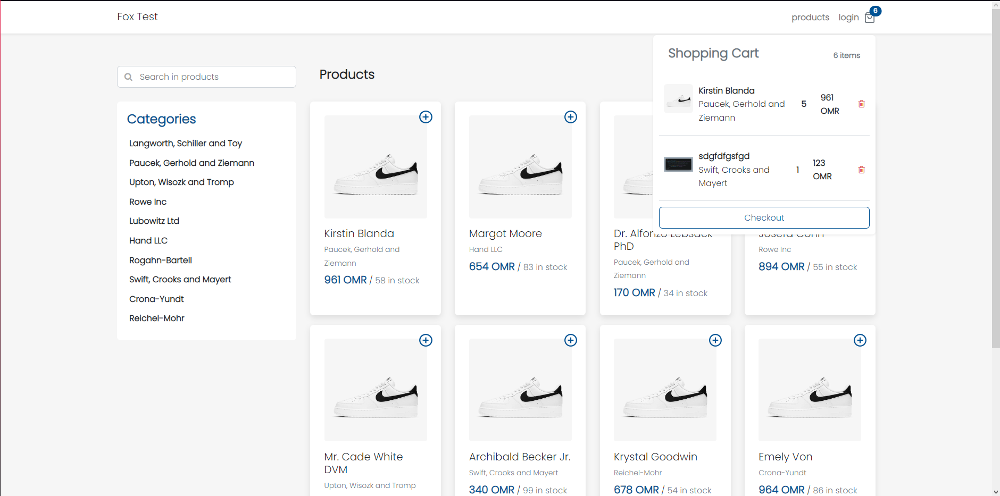

## FoxTest

This is a simple Laravel app that allows users to perform CRUD operations on products and manage their shopping cart.

- [Laravel 9.x](https://github.com/laravel/laravel)
- [Laravel Sanctum](https://laravel.com/docs/9.x/sanctum)
- [Vue 3](https://github.com/vuejs/vue)
- [Vue Router](https://router.vuejs.org/)
- [Vuex](https://vuex.vuejs.org/)
- [Bootstrap](https://getbootstrap.com/)




## How To Use
#### Clone the repository

```bash
git clone https://github.com/oOMrCookieOo/FoxTest.git
```

#### Copy .env.example file to .env and edit credentials also set app url if not already set

```bash
APP_URL=http://localhost:8000
```

#### Install Via Composer

```bash
composer install
```

#### Generate Application Key

```bash
php artisan key:generate
```

#### Migrate Database

```bash
php artisan migrate
```

#### Run Seeder

```bash
php artisan db:seed
```

#### Link Storage

```bash
php artisan storage:link
```

#### Install Node Dependencies

```bash
npm install  --legacy-peer-deps
```
#### Production / Development Mode

```bash
npm run build or npm run dev
```

#### Default seller credentials

```bash
email : seller@demo.com
password : password
```

